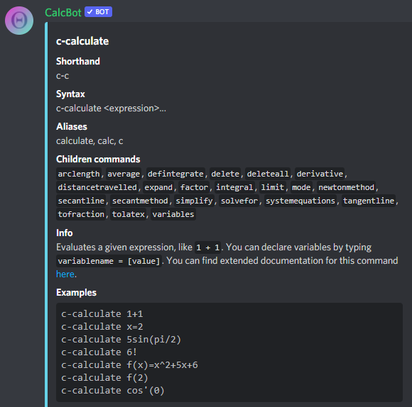
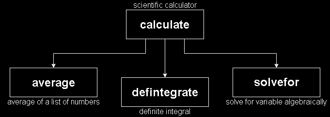
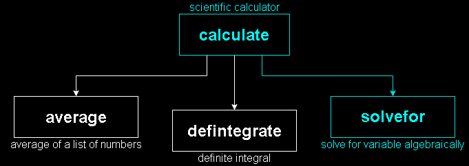
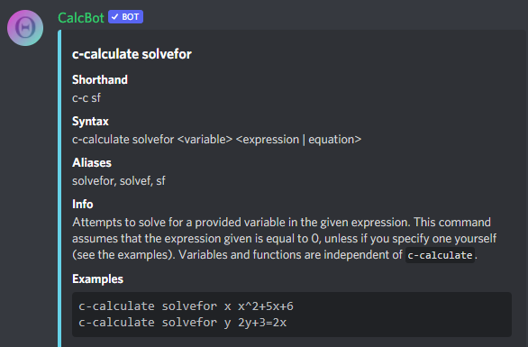

# Command system

CalcBot's command system can be confusing for those new to the bot. This page will hopefully clear up that confusion. Let's get right into it!

## Help embeds

Help embeds are the colored boxes of text that appear when you use the `c-help` command. They provide information on how the command in question can be used. For example, this is the help embed that appears when running `c-help calculate`:

Every help embed will always provide a **shorthand**, **syntax**, **alias**, and **info** field. Some commands, like `c-calculate`, will also include a **children command** and **example** field. This is what each of those fields mean:

* **Shorthand**: A shortcut to accessing the command. Rather than type `c-calculate`, you can also type the shorter `c-c`, for example.
* **Syntax**: Describes the correct usage for the command. For example, the help embed above displays `c-calculate <expression>...`. This indicates that you should type `c-calculate`, followed by an \(math\) expression of any length.
  * You will find that almost all of CalcBot's commands' syntax fields include brackets and other symbols similar to those found in `c-help calculate`. This is what each symbol means:
    * **Angled brackets** \(**&lt;&gt;**\): This item is required.
    * **Square brackets** \(**\[\]**\): This item is optional.
    * **Ellipsis** \(**...**\): This item can be extended for as long as needed.
* **Aliases**: Alternative names for the command. The shortest alias is displayed in the **shorthand** field.
* **Children commands**: _described below_
* **Info**: A description of the command, what it does, and links to other documentation that might be of use.
* **Examples**: Examples of the command being used. You can run these examples immediately in your chat.

With this knowledge, you should be able to understand any unfamiliar command you'll encounter from the info alone.

## Children commands

Many help embeds will also display a **children commands** field. To understand what they are, imagine the command and its children as a tree with branches; the command sits at the base of the tree, and branches expand out from the base to include all of the command's children commands:

So let's say you want to use the `solvefor` children command. In that case, you should write the bot's prefix \(`c-`\), followed by the path to reach `solvefor`:

And indeed, typing `c-calculate solvefor` gives us the command we are looking for:

