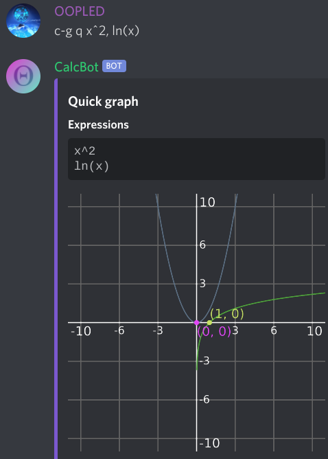
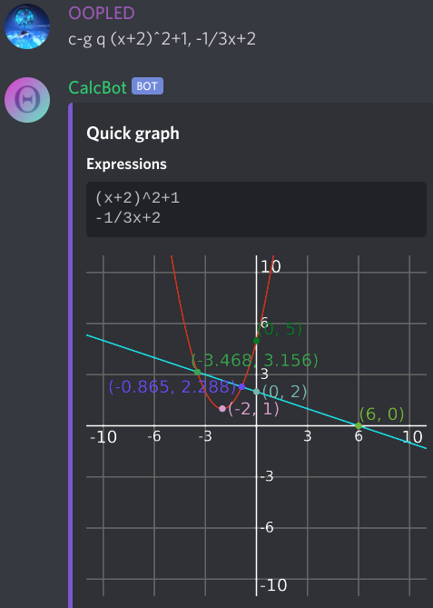
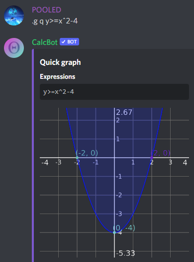
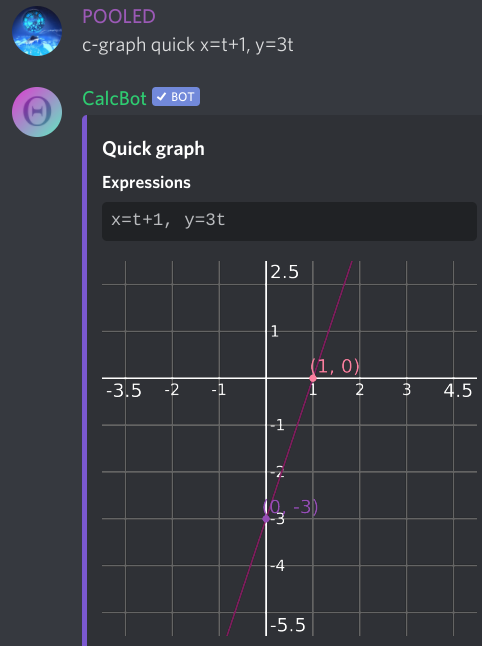

# Graph

`c-graph` allows you to generate graphs of multiple expressions / points. The most commonly used \(and fastest, hence the name\) mode is `c-graph quick`, which accepts a list of graph expressions to graph.








## y=, x=, r=

If you do not include one of the above headers in your expression \(`y=`, `x=`, `r=`\), CalcBot will predict which header you intend and add it to your expression during rendering.

CalcBot will accept relations; that is, expressions that aren't explicity in `y=`, `x=`, or `r=` form. Entering an expression like `3x+2y=15` causes CalcBot to attempt to solve for `y` to graph the expression as if it were in `y=` form.


### Parametric equations

CalcBot can also graph most parametric equations. As long as two equations contain the variable `t`, either the variable `x` or `y`, and are placed right next to each other when typing them, CalcBot will recognize them as part of a parametric equation and graph it accordingly:



## Custom viewport

The viewport of a graph defines where the camera is positioned and how far to zoom in or out. CalcBot allows you to customize the viewport of `c-graph` to display the parts of the graph you want to see.

By default, `c-graph quick` selects the viewport automatically. However, to customize the viewport for `c-graph quick`, use the `c-graph quickviewport` command, then describe the settings of your new viewport as follows:

### 1. Select the properties from this list that you'd like to change:

* **`cam`** - Set the location where the viewport of the graph is centered on.
* **`x`** - Set the x-axis scale of the graph viewport. This number represents the distance in units from the center of the viewport to the left or right edge.
* **`y`** - Set the y-axis scale of the graph viewport. This number represents the distance in units from the center of the viewport to the top or bottom edge.
* **`xy`** - Set both the `x` and `y` properties at once.

### 2. Determine the new values of the properties that you will set

Each of the properties listed above accepts a certain value:

The `cam` property accepts a coordinate given in the form `(x, y)`, which represents the position the viewport will be centered in.

The `x`, `y`, and `xy` properties accept any number or expression \(that can be evaluated with `c-calculate`\).

### 3. Run the command

Type `c-graph quickviewport`, then for each property that you want to change, type the property's name, followed by a colon \(`:`\), and then the value to set that property to, as described in step 2. You may optionally add a comma to separate any more properties to change. Here are examples of viewport settings and what they mean:

```text
c-graph quickviewport cam: (0, 0), x: 10, y: 10
Set viewport center to (0, 0); set x-axis scale to 10, and y-axis scale to 10

c-graph quickviewport x: 300, y: 20
Set x-axis scale to 300, and y-axis scale to 20

c-graph quickviewport cam: (pi, 0), x: 2pi
Set viewport center to (pi, 0); set x-axis scale to 2pi
```

If your viewport was successfully parsed, CalcBot will send a success message, and you will immediately see the new viewport when running `c-graph quick`.

